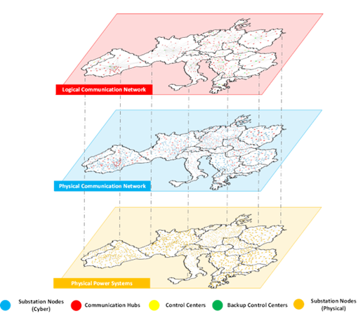

# Generating Large-Scale Synthetic Communication Topologies for Cyber-Physical Power Systems

Synthetic networks aim at generating realistic projections of real-world networks while concealing the actual system information. Researchers have mainly explored methods to create synthetic power systems. However, with the rapid power grid digitalization, new methods are needed for synthetic communication networks of Cyber-Physical Power Systems (CPPS). In this paper, we propose a two-stage generative model for generating synthetic communication topologies of large-scale CPPS based on the existing power grids. It reproduces the existing communication network design process and is capable of generating statistically realistic networks. The proposed method is implemented to create a realistic, large-scale synthetic CPPS for the interconnected power grids in continental Europe. The method is validated by comparing the generated communication network with 18 realistic communication network topologies with different system sizes. The experimental results validate the scalability and effectiveness of the generative model.

# Requirements
* python: 3.7
* pandas: 1.3.5
* networkx: 2.6.3
* numpy: 1.21.6
* xlwt: 1.3.0
* scipy: 1.7.3

To run the requirement.txt, use the following command: pip install -r requirements.txt

# How to Run
* In 01_Input_Data, we provide the power grids topology of . The data is collected from the ENTSO-E website. (https://www.entsoe.eu/data/map/)
* In 02_Code, we provide the code of our generative model. To run the model, one should first run split.py to preprocess the data in folder Example. Then run the Generator.py.
* In 03_Generated_Models, we provide our generation results for European continental power grids.

# Large-Scale Synthetic CPPS for Continental Europe

# If you use our models in a scientific work, consider citing the following papers:
